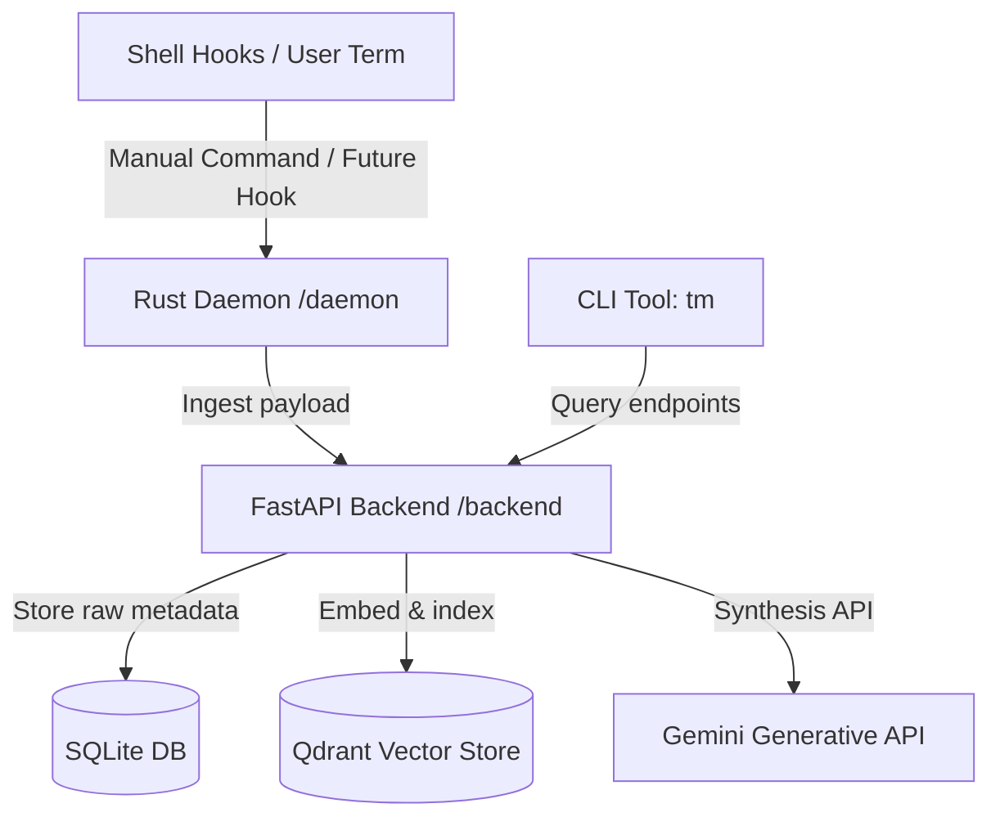

# Terminux

**Your terminal remembers what you forget.**

Terminux captures command history, failures, and recoveries from your shell, then lets you search and replay that memory with natural language — so the next time Docker blows up, you already know how you fixed it last time.

```bash
tm recall "why did docker fail last time?"
tm preflight "deploy"
tm weekly-report
```

---

## Features

- **Semantic recall** — Ask questions in plain English; hybrid vector + SQLite search finds the relevant failure and the fix you used before.
- **Session reconstruction** — Replay full debugging timelines: failure → diagnosis → recovery, with exit codes and outcomes.
- **Failure–recovery linking** — When a previously failing command succeeds, Terminux auto-links the fix for next time.
- **Preflight warnings** — Get warned before re-running commands that historically broke things.
- **Weekly analytics** — Category stats, failure rates, and recurring problem commands.
- **Local-first & private** — Secrets are redacted before storage; SQLite + optional Qdrant stay on your machine.
- **Passive capture** — Bash/Zsh hooks + Rust daemon ingest commands in the background.

---

## Architecture



| Component | Role | Stack |
| :--- | :--- | :--- |
| **FastAPI Backend** | Ingestion, sessionization, recall, reports | Python, FastAPI, SQLite |
| **CLI (`tm`)** | Recall, replay, preflight, weekly reports | Python, `rich`, `httpx` |
| **Capture Daemon** | Background ingest from shell hooks / files | Rust, `clap`, `reqwest` |
| **Embedding Engine** | Semantic index with multi-backend fallback | Gemini → Ollama → local hash |
| **Redaction Layer** | Scrubs keys, JWTs, connection strings, IPs | Python regex |

---

## Quick start

### Prerequisites

- Python 3.11+
- Rust toolchain (for the daemon)
- Optional: [Qdrant](https://qdrant.tech/) for vector search
- Optional: Gemini API key for better embeddings and natural-language answers

### 1. Configure

```bash
cp .env.example .env
# Edit .env — set TERMINUX_GEMINI_API_KEY if you have one
```

### 2. Backend

```bash
cd backend
pip install -r requirements.txt
uvicorn app.main:app --host 127.0.0.1 --port 8000
```

### 3. CLI

```bash
# From repo root — ensure tm is on your PATH, or invoke with ./tm
export TERMINUX_API_URL=http://127.0.0.1:8000
./tm status
```

### 4. Shell hooks (passive capture)

```bash
# Bash
./scripts/install_bash_hook.sh

# Zsh
./scripts/install_zsh_hook.sh
```

Restart your shell, then build and run the daemon:

```bash
cd daemon && cargo build --release
./target/release/terminux-daemon daemon
```

### 5. Manual ingest (no hooks)

```bash
./tm ingest --command "docker compose up" --exit-code 1 --output "port already allocated"
```

---

## CLI reference

| Command | Description |
| :--- | :--- |
| `tm recall "<query>"` | Semantic search over past failures and fixes |
| `tm replay-session --query "<q>"` | Timeline of a captured debugging session |
| `tm preflight "<command>"` | Warn if this command historically failed |
| `tm weekly-report` | Operational stats for the past week |
| `tm correct <id> --category <cat>` | Fix a misclassified event |
| `tm ingest ...` | Manually send an event to the API |
| `tm status` | Backend health and model config |

Examples:

```bash
tm recall "docker port conflict"
tm replay-session --query "nvidia"
tm preflight "deploy"
tm weekly-report
tm correct 42 --category general
```

---

## Configuration

See [`.env.example`](.env.example). Key variables:

| Variable | Default | Purpose |
| :--- | :--- | :--- |
| `TERMINUX_API_URL` | `http://127.0.0.1:8000` | Backend URL for CLI / daemon |
| `TERMINUX_GEMINI_API_KEY` | — | Embeddings + answer synthesis |
| `TERMINUX_EMBEDDING_BACKEND` | `gemini` | `gemini` or `hash` |
| `TERMINUX_QDRANT_ENABLED` | `true` | Enable vector store |
| `TERMINUX_QDRANT_URL` | `http://127.0.0.1:6333` | Qdrant endpoint |
| `TERMINUX_SESSION_GAP_SECONDS` | `1200` | Idle gap that starts a new session |
| `TERMINUX_SQLITE_PATH` | `./backend/data/terminux.db` | Local event store |

---

## How it works

1. **Capture** — Shell hooks (or `tm ingest`) send command, cwd, exit code, and truncated output to the daemon → API.
2. **Redact & classify** — Secrets are stripped; events are categorized and root-cause hints extracted from stderr/stdout.
3. **Sessionize** — Commands are grouped by project root and time gap into logical sessions.
4. **Index** — Metadata lands in SQLite; embeddings go to Qdrant (when enabled).
5. **Recall** — Queries fuse vector similarity with SQL fallbacks, then optionally synthesize a natural-language answer via Gemini.
6. **Recover** — A later success of a previously failing command is linked as the fix.

---

## Development

```bash
# Backend tests
pip install -r backend/requirements.txt pytest
pytest tests/

# Daemon
cd daemon && cargo test
```

Project layout:

```
terminux/
├── backend/app/     # FastAPI API, DB, embeddings, redaction
├── daemon/          # Rust capture agent
├── scripts/         # Bash/Zsh hook installers
├── tests/           # Pytest suite
└── tm               # CLI entrypoint
```

---

## License

See repository for license details.
