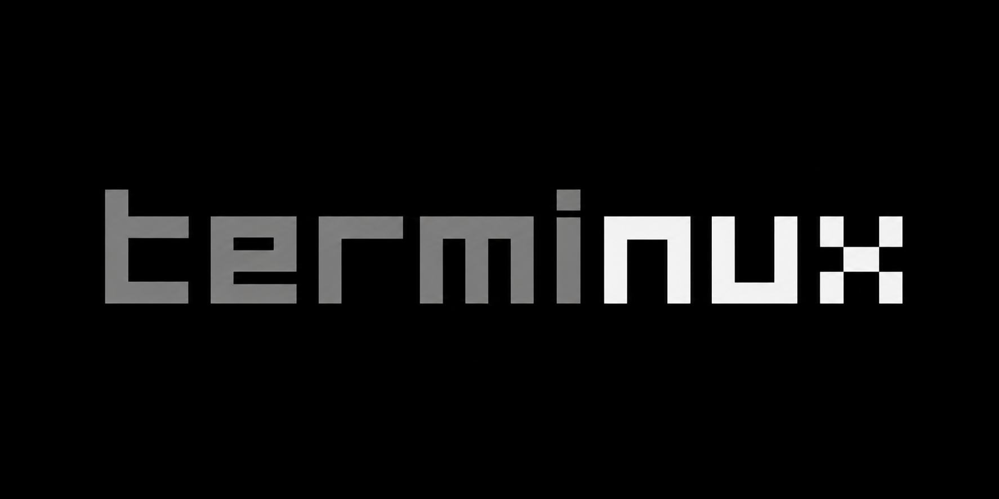

<p align="center">
  
</p>

# Terminux (MVP Scaffold)

Terminux is a persistent AI memory layer around terminal workflows.

This scaffold includes:
- Rust capture daemon (`daemon/`) for shipping command events.
- FastAPI memory service (`backend/`) with SQLite + Qdrant integration.
- CLI (`./tm`) for `recall`, `weekly-report`, `replay-session`, and `preflight`.

## 1) Run Qdrant

```bash
docker run -p 6333:6333 -p 6334:6334 qdrant/qdrant
```

## 2) Run backend

```bash
cd backend
python -m venv .venv
source .venv/bin/activate
pip install -r requirements.txt
uvicorn app.main:app --reload
```

Environment variables (optional):
- `TERMINUX_SQLITE_PATH` (default: `./data/terminux.db`)
- `TERMINUX_QDRANT_URL` (default: `http://127.0.0.1:6333`)
- `TERMINUX_QDRANT_COLLECTION` (default: `terminux_memory`)
- `TERMINUX_QDRANT_ENABLED` (default: `true`)
- `TERMINUX_API_URL` for CLI/daemon (default: `http://127.0.0.1:8000`)

Embeddings configuration:
- `TERMINUX_EMBEDDING_BACKEND` (`hash` or `gemini`, default: `hash`)
- `TERMINUX_EMBEDDING_DIM` (default: `128`)
- `TERMINUX_EMBEDDING_TIMEOUT_SECONDS` (default: `10`)

Google AI Studio (Gemini) settings:
- `TERMINUX_GEMINI_API_KEY` (required when backend is `gemini`)
- `TERMINUX_GEMINI_EMBEDDING_MODEL` (default: `models/gemini-embedding-2`)
- `TERMINUX_GEMINI_API_BASE` (default: `https://generativelanguage.googleapis.com/v1beta`)

Example (Gemini embeddings):

```bash
export TERMINUX_EMBEDDING_BACKEND=gemini
export TERMINUX_GEMINI_API_KEY="your_google_ai_studio_key"
```

Legacy `TERMINUS_*` env vars are still accepted for compatibility.

## 3) Build daemon

```bash
cd daemon
cargo build
```

Binary path:
- `daemon/target/debug/terminux-daemon`

## 4) Use the CLI

```bash
./tm ingest "docker compose up" --output "address already in use" --exit-code 1
./tm ingest "docker compose up" --output "started" --exit-code 0

./tm recall docker
./tm replay-session --query docker
./tm preflight docker "docker compose up"
./tm weekly-report
```

## 5) Optional shell hook (bash)

```bash
./scripts/install_bash_hook.sh
```

Then restart shell.

## API endpoints

- `POST /v1/events`
- `GET /v1/recall?query=<text>&limit=<n>`
- `GET /v1/replay-session?session_id=<id>` or `?query=<text>`
- `POST /v1/preflight`
- `GET /v1/weekly-report?days=7`
- `GET /v1/validation`
- `GET /health`

## Notes

- Sensitive text redaction runs before persistence.
- If Gemini embeddings fail at runtime, the backend falls back to hash embeddings.
- If Qdrant is unavailable, recall gracefully falls back to SQLite text search.
- Graph DB is intentionally deferred to post-MVP.
